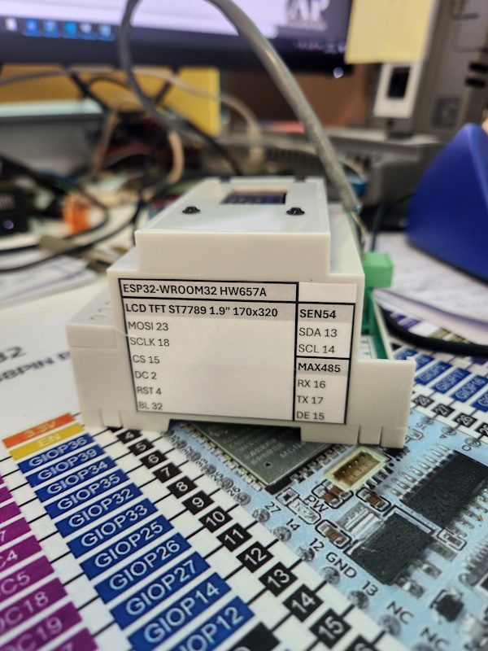

# ESP32-S3 LoRa BACnet Gateway

LoRa-to-BACnet gateway firmware for the Heltec WiFi LoRa 32 V4 board using the SX1262 radio and a 128x64 SSD1315 OLED. The gateway receives validated LoRa sensor packets and publishes the resulting values into the BACnet object model while keeping BACnet/IP and BACnet MS/TP services active.

The project is optimized for the gateway use case. BACnet identity, transport settings, LoRa protocol expectations, defaults, and persistence configuration remain centralized in `main/User_Settings.c`.

## 📡 Features

* BACnet/IP over Wi-Fi
* BACnet MS/TP over RS485
* BACnet Change of Value (`COV`)
* LoRa packet receive/validation path for fixed-size sensor payloads
* LoRa-to-BACnet bridge into BACnet analog objects
* SSD1315 OLED status display for received packets and latest values
* NVS persistence for writable BACnet properties
* Runtime-configurable object names, descriptions, units, and COV increments
* Full BACnet Device identity
* Startup settings report and FreeRTOS stack monitoring
* Private credentials excluded from source control

## 🎛️ Gateway build selection

Use the ESP-IDF target selection normally, then select the hardware/display
profile in Menuconfig:

```text
ESP-IDF: Set Espressif Device Target
ESP-IDF: SDK Configuration Editor
Project hardware
└── Display profile
    └── LoRa 32 V4 SX1262 gateway receiver
```

Hardware profiles are configurable at compile time. The profile selection is
the integration point for other processor boards, displays, and display
drivers; a profile can provide its own GPIO mapping, UI, and optional
peripherals. The active project configuration includes the LoRa gateway
profile, and additional profiles can be added to the same Menuconfig choice.

After changing the target or GPIO mapping, run a full clean build.

## 📊 BACnet Object Model

The gateway build exposes 32 BACnet objects in the current firmware. The
active profile maps received LoRa packet values into the BACnet object model
while keeping the configured AV, BV, BI, and BO objects available for
monitoring and expansion.

| Objects     | Default purpose                                           |
| ----------- | --------------------------------------------------------- |
| `AI1–AI16`  | General-purpose Analog Inputs and telemetry channels       |
| `AV1–AV16`  | Available general Analog Values                           |
| `BV1–BV4`   | Available general Binary Values                           |
| `BI1–BI4`   | Available general Binary Inputs                           |
| `BO1–BO4`   | Available general Binary Outputs                          |

These are logical default roles. BACnet instance numbers, names, descriptions, units, initial values, COV increments, and binary text are configurable through the parallel arrays in `main/User_Settings.c`.

## ⚙️ Configuration

### Public settings

Edit:

```text
main/User_Settings.c
main/User_Settings.h
```

These files contain:

* BACnet Device identity and instance;
* BACnet/IP and MS/TP enable flags;
* static IP and BBMD settings;
* MS/TP MAC address, baud rate, Max Master, and Max Info Frames;
* BACnet object instances and metadata;
* NVS default-restoration policy.

### Private credentials

Copy:

```text
main/User_Private_Settings.example.h
```

to:

```text
main/User_Private_Settings.h
```

Then enter the Wi-Fi and, when required, Adafruit IO credentials. The private file is ignored by Git.

## 🚀 Build

Tested environment:

* ESP-IDF `6.0.2`
* Visual Studio Code with the ESP-IDF extension
* Git

The supplied PowerShell wrapper verifies the ESP-IDF installation before running `idf.py`:

```powershell
powershell -NoProfile -ExecutionPolicy Bypass `
    -File .\tools\build_idf60.ps1 build
```

After changing a display profile or TFT_eSPI setup:

```powershell
powershell -NoProfile -ExecutionPolicy Bypass `
    -File .\tools\build_idf60.ps1 fullclean

powershell -NoProfile -ExecutionPolicy Bypass `
    -File .\tools\build_idf60.ps1 build
```

Flash and monitor using the ESP-IDF extension or the corresponding wrapper arguments.

See [`SETUP.md`](SETUP.md) for the complete environment, configuration, build, and flashing procedure.

## 🌐 Validation and Commissioning

Use YABE (Yet Another BACnet Explorer) to discover the device with `Who-Is`, inspect
its BACnet objects, write supported properties, and verify Change of Value (`COV`)
notifications. BACnet/IP uses the standard UDP port `47808` (`0xBAC0`), which can
also be inspected with Wireshark when troubleshooting network communication.

For BACnet MS/TP installations, use a daisy-chain RS485 layout, verify the selected
baud rate and MAC settings, and install 120-ohm termination only at the two physical
ends of the bus. Avoid frequent automated writes to NVS-backed properties because
unnecessary flash writes can reduce storage lifetime.

## 💾 Persistence

Supported BACnet object properties and sensor configuration values are stored in NVS.

Normal operation:

```c
USER_OVERRIDE_NVS_ON_FLASH = 0;
```

To erase saved values and restore compiled defaults on the next boot:

```c
USER_OVERRIDE_NVS_ON_FLASH = 1;
```

After restoring the defaults, return the setting to `0`; otherwise NVS will be erased at every startup.

## 📜 Documentation

* [`SETUP.md`](SETUP.md) — environment, configuration, build, and flashing
* [`docs/profiles/`](docs/profiles/) — supported hardware/display profiles and wiring
* [`docs/DISPLAY_HARDWARE_PROFILES_GUIDE.md`](docs/DISPLAY_HARDWARE_PROFILES_GUIDE.md) — adding and maintaining profiles
* [`OBJECTS_CONFIGURATION.md`](OBJECTS_CONFIGURATION.md) — BACnet object configuration and NVS persistence

The legacy [`Profiles.md`](Profiles.md) file redirects to the profile documentation folder.

## 📂 Source Layout

```text
main/
├── app/                 Application services and gateway coordination
│   └── sensors/         Legacy auxiliary sensor services (disabled in the gateway profile)
├── bacnet/              BACnet runtime, coordinator, event bus, and objects
│   └── objects/         AI, AV, BI, BV, and BO implementations
├── platform/            Wi-Fi and MS/TP RS485 interfaces
├── ui/
│   ├── hardware/        Profile-specific touch/display support
│   └── profiles/        Selectable display/UI implementations
├── User_Settings.c      Device and BACnet configuration
├── User_Settings.h      Object counts and logical role definitions
└── main.c               Application startup
```

## Screenshots

### Production installation


### ESP32 BACnet hardware



### BACnet objects in YABE

This view is not tied to a legacy sensor profile and is represented in the BACnet explorer after commissioning.


