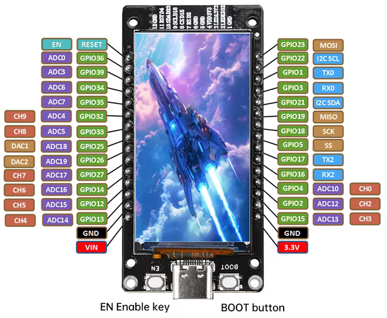

# HW657A

## Summary

ESP32-WROOM-32 profile for the integrated HW657A ST7789 portrait display.

## Selection

```text
ST7789 170x320 - HW657A - Simple UI
```

```c
CONFIG_USER_DISPLAY_ST7789_HW657A
```

## Display

| Setting | Value |
|---|---|
| Intended target | ESP32 |
| Controller | ST7789 |
| Native resolution | 170×320 |
| Runtime orientation | 320×170 landscape |
| Interface | SPI |
| SPI frequency | 20 MHz |
| Colour order | BGR |
| Inversion | On |
| Touch | None |

## Display wiring

| Signal | GPIO |
|---|---:|
| MOSI | 23 |
| SCLK | 18 |
| MISO | Not used |
| CS | 15 |
| DC | 2 |
| RST | 4 |
| Backlight | 32 |

## Sensor defaults

The legacy auxiliary sensor defaults are not part of the active gateway profile documentation. This profile is kept for display-only validation and does not compile the retired auxiliary-sensor application path.

## Boot and flashing note

GPIO2 and GPIO15 are original ESP32 boot-strapping pins.

The integrated board may operate and restart normally with this wiring, but an external display that drives GPIO2 during reset can prevent UART download mode. If flashing fails, disconnect the display DC or display power during flashing, or use a hardware revision with non-strapping control pins.

## Source files

```text
main/ui/profiles/display_st7789_hw657a.cpp
components/TFT_eSPI/User_Setups/Setup_Project_ST7789_HW657A.h
```

## Image


